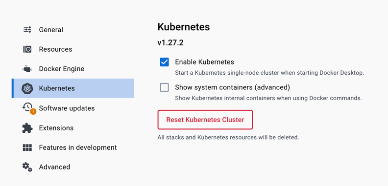

# mayday

Сервис алертинга, отвечающий за управление конфигурациями алертов

## Роль сервиса в системе алертинга

Приблизительная схема системы алертинга выглядит следующим образом:


Часть системы алертинга, в которой участвует mayday:


В рамках данного документа будут объяснены все взаимодействия со схемы выше.

## Внутреннее устройство сервиса

### Структура проекта

Проект использует [feature-layered](https://phauer.com/2020/package-by-feature/) структуру пакетов. 
Взаимодействие с prometheus, взаимодействие с alertmanager, формирование конфигураций алертов и протокол для взаимодействия с сервисом разнесены по разным корневым каталогам.
Это позволяет вносить правки в конкретную "фичу" и не бояться, что они сломают соседний функционал. 
В сервисе есть функционал, которые переиспользуются для всех "фич" - он вынесен в пакет [common](src/main/java/dev/vality/alerting/mayday/common).

Если вас интересует не определенный функционал сервиса, а общее понимание его устройства, то лучше начать изучение кодовой базы с класса [AlertingService](src/main/java/dev/vality/alerting/mayday/thrift/service/AlertingService.java) - он реализует [thrift-протокол](https://github.com/valitydev/mayday-proto), через который и осуществляется взаимодействие с сервисом.

##### Prometheus

Prometheus содержит информацию о всех метриках, которые отдают ему экспортеры. С помощью правил алертинга (они же [alerting rules](https://prometheus.io/docs/prometheus/latest/configuration/alerting_rules/)) можно настроить prometheus таким образом, чтобы он на постоянной основе выполнял переданный в правиле алертинга запрос к метрикам. Если результат запроса "положителен" (`true`/ не `0`) дольше, чем период времени, который так же передается в правиле алертинга, prometheus отправляет запрос в alertmanager.

Сервис mayday отвечает за создание и удаление правил алертинга. 

API, через которое происходит взаимодействие с prometheus, описано в разделе [prometheus-operator](#prometheus-operator).

##### Alertmanager

Alertmanager содержит информацию о том, кому, куда и с какой периодичностью отправлять алерты. Чтобы лучше понимать специфику алертменеджера, рекомендуется изучить официальную [документацию](https://prometheus.io/docs/alerting/latest/alertmanager/).

В рамках системы алертинга, сервис mayday создает новый маршрут([route](https://prometheus.io/docs/alerting/latest/configuration/#route)) в конфигурации алертменеджера для каждого нового правила алертинга.
Когда алертменеджер отправляет алерт, в качестве способа отправки используется [webhook](https://prometheus.io/docs/alerting/latest/configuration/#webhook_config), а в качестве адресата - сервис mayday (вебхук прилетает в [контроллер](src/main/java/dev/vality/alerting/mayday/alertmanager/controller/WebhookController.java)). Mayday на основе содержимого вебхука определяет получателся алерта и "прокидывает" его дальше, предварительно преобразовав в нужный формат - в данный момент единственным получаетелем является сервис [alert-tg-bot](https://github.com/valitydev/alert-tg-bot).

API, через которое происходит взаимодействие сервиса mayday с alertmanager, описано в разделе [prometheus-operator](#prometheus-operator).

#### Prometheus-operator

Сервис "общается" с prometheus'ом и alertmanager'ом через [API](https://prometheus-operator.dev/docs/operator/api/), которое предоставляет [prometheus-operator](https://prometheus-operator.dev/).

В случае с prometheus, mayday создает одну группу правил ([RuleGroup](https://prometheus-operator.dev/docs/operator/api/#monitoring.coreos.com/v1.RuleGroup)) с именем `mayday-managed-rule`. Далее, при получении запроса на создание алерта, внутри этой группы создается отдельное [правило](https://prometheus-operator.dev/docs/operator/api/#monitoring.coreos.com/v1.Rule) на каждый алерт. Реализацию этой логики можно изучить в коде [клиента prometheus](src/main/java/dev/vality/alerting/mayday/prometheus/client/k8s/PrometheusClient.java).

В случае с alertmanager, mayday создает одну конфигурацию алертменеджера ([AlertmanagerConfig](https://prometheus-operator.dev/docs/operator/api/#monitoring.coreos.com/v1alpha1.AlertmanagerConfig)) с именем `mayday-managed-config`. Далее, при получении запроса на создание алерта, внутри этой конфигурации создается отдельный [маршрут](https://prometheus-operator.dev/docs/operator/api/#monitoring.coreos.com/v1alpha1.Route) на каждый алерт. Реализацию этой логики можно изучить в коде [клиента alertmanager](src/main/java/dev/vality/alerting/mayday/alertmanager/client/k8s/AlertmanagerClient.java).

#### Конфигурации алертов

Алерты, которые поддерживает система алертинга, описаны в виде json-конфигураций и хранятся [тут](src/main/resources/template).
Рассмотрим одну из таких конфигураций (в урезанном виде): 

```json
{
  "id": "payment_conversion",
  "readable_name": "Конверсия платежей",
  "prometheus_query": "round(100 * sum(sum_over_time(ebm_payments_final_status_count{provider_id=~\"${provider_id}\", terminal_id=~\"${terminal_id}\",shop_id=~\"${shop_id}\",status=\"captured\"}[${conversion_period_minutes}m])) / sum(sum_over_time(ebm_payments_final_status_count{provider_id=~\"${provider_id}\",terminal_id=~\"${terminal_id}\",shop_id=~\"${shop_id}\",status=~\"captured|failed\"}[${conversion_period_minutes}m])), 1) ${boundary_type} ${conversion_rate_threshold}",
  "alert_name_template": "Конверсия платежей по провайдеру '${provider_id}', терминалу '${terminal_id}' и магазину '${shop_id}' за последние ${conversion_period_minutes} минут ${boundary_type} ${conversion_rate_threshold}%",
  "alert_notification_template": "Конверсия платежей по провайдеру '${provider_id}', терминалу '${terminal_id}' и магазину '${shop_id}' за последние ${conversion_period_minutes} минут ${boundary_type} ${conversion_rate_threshold}%! Текущее значение: {{ $value }}%",
  "parameters": [
    {
      "id": 1,
      "substitution_name": "provider_id",
      "readable_name": "Введите идентификатор провайдера (опционально)",
      "mandatory": false,
      "multiple_values": true,
      "dictionary_name": "providers"
    }
  ]
}
```

| Поле                          | Описание                                                                                                                                                                                                                                                              |
|-------------------------------|-----------------------------------------------------------------------------------------------------------------------------------------------------------------------------------------------------------------------------------------------------------------------|
| `id`                          | Уникальный идентификатор алерта                                                                                                                                                                                                                                       |
| `readable_name`               | Название алерта. Выводится пользователю, когда он хочет увидеть доступные к созданию алерты                                                                                                                                                                           |
| `prometheus_query`            | Запрос в прометеус, который будет выполнятся в рамках [alerting rules](https://prometheus.io/docs/prometheus/latest/configuration/alerting_rules/). Запрос в конфигурации содержит переменные (в формате `${variable_name}`), которые заменяются реальными значениями |
| `alert_name_template`         | Шаблон с названием уже созданного алерта. Выводится  пользователю, когда он хочет увидеть свои созданные алерты                                                                                                                                                       |
| `alert_notification_template` | Шаблон алерта. Это сообщение присылается пользователю, когда срабатывает алерт                                                                                                                                                                                        |
| `parameters`                  | Массив параметров, которые должен задать пользователь, чтобы mayday смог создать алерт                                                                                                                                                                                |

Каждый параметр состоит из набора полей:


| Поле                | Описание                                                                                                                                                                                                                                                                                               |
|---------------------|--------------------------------------------------------------------------------------------------------------------------------------------------------------------------------------------------------------------------------------------------------------------------------------------------------|
| `id`                | Уникальный числовой идентификатор параметра. Служит для сортировки параметров (чтобы они гарантированно выводились пользователю в определенном порядке).                                                                                                                                               |
| `substitution_name` | Название переменной, в которое будет подставлятся значение, которое передал пользователь. Значение подставляется в поля `prometheus_query`, `alert_name_template`, `alert_notification_template` описанные выше                                                                                        |
| `readable_name`     | Название параметра. Выводится пользователю, чтобы он понял, какая информация от него требуется                                                                                                                                                                                                         |
| `mandatory`         | Флаг обязательности параметра. Если `false`, то пользователь может не вводить этот параметр                                                                                                                                                                                                            |
| `multiple_values`   | Флаг, определяющий, поддерживает ли параметр несколько значений                                                                                                                                                                                                                                        |
| `dictionary_name`   | В случае, когда пользователь не должен вводить значение параметра, а должен выбрать его из списка значений, в данном поле указывается название справочника. Поддерживаемые справочники описаны [здесь](src/main/java/dev/vality/alerting/mayday/alerttemplate/model/alerttemplate/DictionaryType.java) |
| `regexp`            | В случае, когда пользователь должен вводить значение параметра, здесь указывается регулярное выражение, с помощью которого можно провести валидацию ввода                                                                                                                                              |


#### Thrift

Взаимодействие с сервисом осуществляется через [протокол](https://github.com/valitydev/mayday-proto).  Протокол реализует класс [AlertingService](src/main/java/dev/vality/alerting/mayday/thrift/service/AlertingService.java).

### Запуск и отладка сервиса на локальной машине

Для запуска сервиса на локальной машине требуется следующее:

1. Запустить k8s. Например, в рамках Docker Desktop: Settings -> Kubernetes -> Enable Kubernetes

2. Выполнить все шаги разделов [Getting started](https://prometheus-operator.dev/docs/user-guides/getting-started/) и [Alerting](https://prometheus-operator.dev/docs/user-guides/alerting/). В результате на вашей машине будет локально работающий кластер k8s с установленным оператором прометеус и работающей связкой prometheus + alertmanager.
3. Запустить сервис mayday (прямо из IDE)

Готово. Теперь можно отлаживать работу сервиса с помощью [woorl'а](https://github.com/valitydev/woorl).

Примеры запросов:

Получить список поддерживаемых алертов:
```
woorl -s /mayday-proto/proto/mayday.thrift 'http://localhost:8022/mayday' AlertingService GetSupportedAlerts
```

Получить алерты пользователя:
```
woorl -s /mayday-proto/proto/mayday.thrift 'http://localhost:8022/mayday' AlertingService GetUserAlerts '"username"'
```

Удалить алерт пользователя:
```
woorl -s /mayday-proto/proto/mayday.thrift 'http://localhost:8022/mayday' AlertingService DeleteAlert '"username"' '"323de93494df90733484f94f1afd2b44"'
```

Создать алерт:

```
woorl -s /mayday-proto/proto/mayday.thrift 'http://localhost:8022/mayday' AlertingService CreateAlert 
    '{
    "alert_id": "payment_conversion",
    "parameters": [
    {
    "id": "1",
    "value": "(1) test_provider"
    },
    {
    "id": "1",
    "value": "(2) test_tete"
    },
    {
    "id": "1",
    "value": "-"
    },
    {
    "id": "2",
    "value": "-"
    },
    {
    "id": "3",
    "value": "(test_shop) shop details"
    },
    {
    "id": "4",
    "value": "Меньше порогового значения"
    },
    {
    "id": "5",
    "value": "50"
    },
    {
    "id": "6",
    "value": "60"
    },
    {
    "id": "rule_check_duration_minutes",
    "value": "5"
    },
    {
    "id": "alert_repeat_minutes",
    "value": "60"
    }
    ],
    "user_id": "username"
    }'
```
